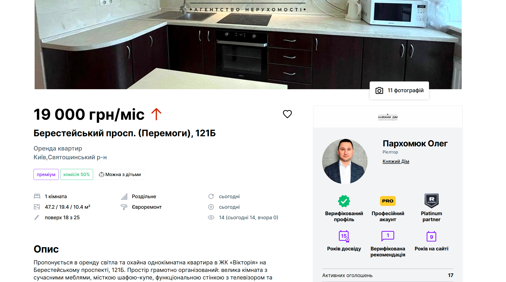
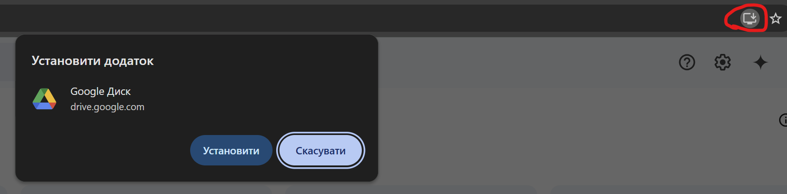

# Vue 3 + Vite

## Інструкція для запуску та виконання завдання

### Запуск проєкту в режимі розробки

1. Встановіть залежності:
   ```bash
   npm install
   ```
2. Запустіть проєкт:
   ```bash
   npm run dev
   ```

### Backend

Проєкт використовує бекенд, реалізований на платформі [Appwrite](https://appwrite.io/docs). Він включає дві основні таблиці:

- **users**: для авторизації та аутентифікації (запити `login`, `register`, `logout` вже реалізовані).
- **apartments**: колекція, з якою ви будете працювати.

#### Структура колекції `apartments`:

- `title` (string, required): заголовок оголошення.
- `description` (string): опис.
- `number_of_rooms` (integer, required): кількість кімнат.
- `price` (integer, required): ціна.
- `square` (integer): площа нерухомості.
- `is_active` (boolean, required): доступність квартири.
- `property_type` (enum, required): тип нерухомості (`apartment`, `house`, `townhouse`, `cottage`, `hotel`, `studio`).
- `image_url` (URL): посилання на головне зображення.

---

### Завдання

#### 1. Реалізувати сторінки:

- **Home**:

  - Відобразити список квартир у вигляді карток (поля: `title`, `number_of_rooms`, `price`, `square`, `image_url`).
  - Додати функціонал:
    - Фільтрація за:
      - Мінімальною та максимальною ціною.
      - Доступністю (`is_active`).
      - Мінімальною та максимальною площею.
    - Пошук за назвою (`title`).
    - Пагінація (по 5 елементів на сторінку).
    - Сортування.
    - Перехід на сторінку детального перегляду квартири (**ListingDetails**).

- **ListingDetails**:

  - Відобразити всі поля конкретної квартири.
  - Дизайн сторінки має бути схожим на
    

- **CreateEditListing**:
  - Реалізувати форму для створення або редагування квартири.
  - Додати валідацію полів.
    Необов'язково: реалізуйте submit форми редагування та створення оголошення, для завантаження картинки (і для отримання image_url) використовуйте appwrite bucket (storage)

#### 2. Форма авторизації/реєстрації

- Покращити дизайн форми.
- Використати бібліотеку `shadcn ui vue`.

#### 3. Додати підтримку PWA

- Забезпечити можливість встановлення додатку як PWA.
  

#### 4. Адаптивний дизайн

- Дизайн має бути сучасним, інтуїтивно зрозумілим та адаптивним.
- Для мобільних пристроїв реалізувати **Navbar** у вигляді hamburger-меню.

## Послідовність дій

1. Клонуйте цей репозиторій на свій локальний комп'ютер.
2. Запустіть проект
3. Виконайте завдання
4. Завантажте код до власного репозиторію на GitHub у режимі private і додайте користувача mvk-mash у список колабораторів (Collaborators).
